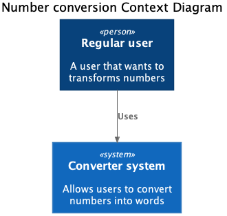
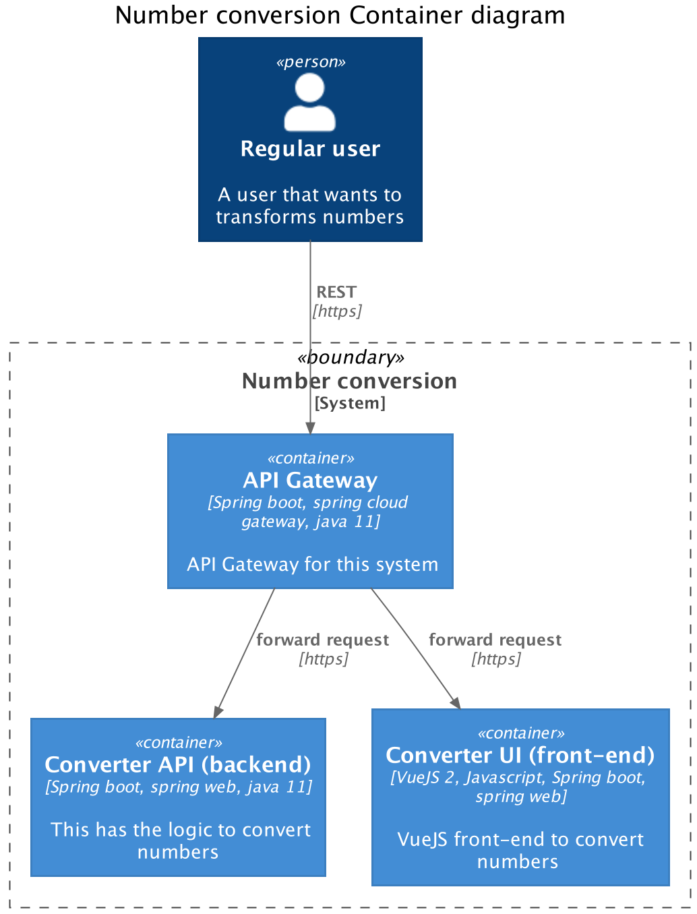

# Sonatype take home exercise to convert numbers to words

With this system a user can convert integer numbers to english words



This system has three components:
- Converter API (backend). This exposes the operations needed to convert numbers to english words
- Converter UI (frontend). This has the view components to interact with the backend to show the result to the end user 
- API Gateway. Works a single entry-point for this system.




## Run the program
Before you begin make sure you have a Java 11 as your first java executable in 
your PATH environment variable.
You will need as well these ports available: 28080, 28081, 28082

Clone the repository:
```
git clone https://github.com/jsanin/converter.git
cd converter
```

Go to each of the folders and run: `./mvnw spring-boot:run`

To run converter-api
```
cd converter-api
./mvnw spring-boot:run
```
This will start on port 28081

To run converter-ui
```
cd converter-ui
./npm install
./mvnw spring-boot:run
```
This will start on port 28082

To run converter-gateway
```
cd converter-gateway
./mvnw spring-boot:run
```
This will start on port 28080

Now go to https://localhost:28080/ui enter an integer you'll see the words in English.
You will need to accept the warning the browser show you due to the selft signed certificate.

## API Documentation

First run the converter-api application as explained above and then go to 
http://localhost:28081/converter/swagger-ui.html

## Test coverage
In this exercise is included unit and integration test. If you want to see 
the results, go to:

For Unit testing
```
cd converter-api
./mvnw test
```

For unit and integration testing
```
cd converter-api
./mvnw verify
```

## Application logs

Applications' logs by default are in `${HOME}/dev/converter/logs` you can
modify this changing the application property `logging.file.path`
