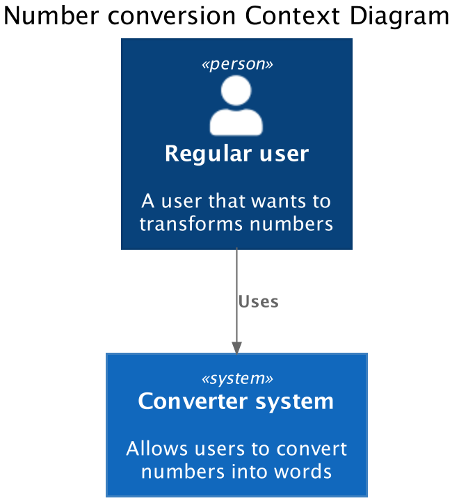

# Sonatype take home exercise to convert numbers to words

With this system a user can convert integer numbers to english words



This system has three components:
- Converter API (backend). This exposes the operations needed to convert numbers to english words
- Converter UI (frontend). This has the view components to interact with the backend to show the result to the end user 
- API Gateway. Works a single entry-point for this system


## Run the program
Before you begin make sure you have a Java 11 as your first java executable in 
your PATH environment variable.

After you clone the repository. Go to each of the folders and run: `./mvnw spring-boot:run`

To run converter-api
```
cd converter-api
./mvnw spring-boot:run
```
This will start on port 28081

To run converter-ui
```
cd converter-ui
./mvnw spring-boot:run
```
This will start on port 28082

To run converter-gateway
```
cd converter-gateway
./mvnw spring-boot:run
```
This will start on port 28080

Now go to http://localhost:28080/ui enter an integer you'll see the words in English

